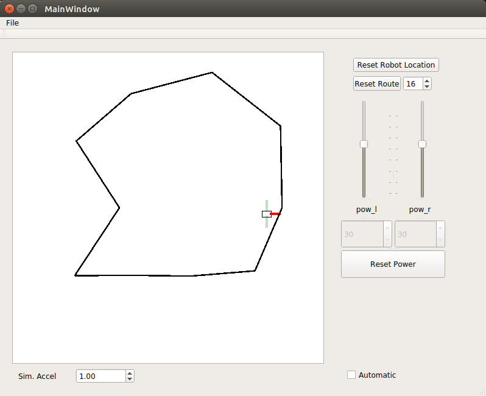

## FunRobo Wall Follower



### Deliverable

For this deliverable, you're going to implement a simple automata for a simulation.

Namely, we're going to develop a wall-following robot. This may even be a useful behavior for your final robot.

After you fork this repository, do your hardware developments and create a pull request.

We'll run your code and see how well it performs with the system!

If you have any problems, or discover a strange bug, feel free to contact me.

Your task description is as follows:

### System Description

#### Inputs

- [std_msgs/Float32] ir_f : front IR with 80cm range
- [std_msgs/Float32] ir_l : left IR with 80cm range
- [std_msgs/Float32] ir_r : right IR with 80cm range

#### Outputs

- [std_msgs/Float32] vel_l : velocity of the left motor
- [std_msgs/Float32] vel_r : velocity of the right motor

#### Learning Objectives :

- Basic Inverse-Kinematics for Differential-Drive Robot
- Simple Autonomy Engine for Wall-Following Behavior
- Experience with Software-In-The-Loop Testing Control Code
- Proficiency with C++ and ROS

Let's get it started!

### Setup

```bash
sudo apt-get install qtbase5-dev
```


### Installing the simulator

First, [Fork the repository](https://help.github.com/articles/fork-a-repo/) to your own copy.
Then, you can work off of the fork and submit your results via pull request!

```bash
roscd && cd ../src
git clone <your_repository>/funrobo_wallfollower.git 
cd ..
rosdep install funrobo_wallfollower
catkin_make [--pkg funrobo_wallfollower]
```

Note that in the above step, we're cloning from your copy of the repository, since you created a fork.

The content within the bracket is optional. When use the --pkg flag when you want to build only one package.

### Running the simulator

```bash
rosrun funrobo_wallfollower simulator
```

### References

- [Wall Following](http://www.mlees-robotronics.in/home/robotics/wall-following-algorithm)

- [Diff Drive Kinematics](https://chess.eecs.berkeley.edu/eecs149/documentation/differentialDrive.pdf)
